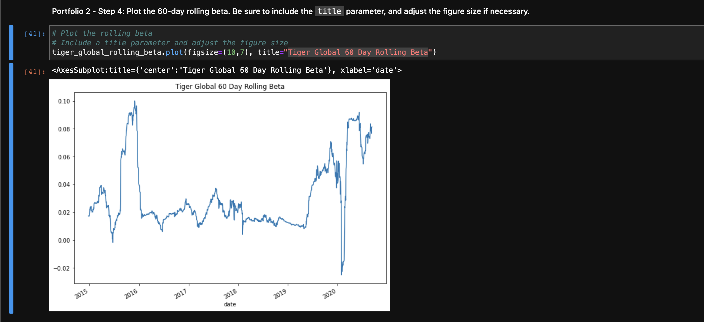

# Module_4_Challenge
This is the repository for my module 4 challenge. In this module challenge, we analyzed the performance, volatility, risk and risk-return for four funds and the S&P 500, and then diversified our portfolio. We ran calculations on the data and then graphed our results. In the end I chose Tiger Global management as the best portfolio.

---

## Technologies

Import the follwing into your jupyter notebook:

```python
import pandas as pd
from pathlib import Path
import numpy as np
%matplotlib inline
```

---

## Example

This image shows the Tiger Global 60 Day Rolling Beta, which is why I selected it as the best portfolio option:



---

## Contributors

UCB Fintech Bootcamp, Wynham Guillemot 

---

## License

MIT License

Copyright (c) [2021] [UCB Fintech Bootcamp, Wyham Guillemot]

Permission is hereby granted, free of charge, to any person obtaining a copy
of this software and associated documentation files (the "Software"), to deal
in the Software without restriction, including without limitation the rights
to use, copy, modify, merge, publish, distribute, sublicense, and/or sell
copies of the Software, and to permit persons to whom the Software is
furnished to do so, subject to the following conditions:

The above copyright notice and this permission notice shall be included in all
copies or substantial portions of the Software.

THE SOFTWARE IS PROVIDED "AS IS", WITHOUT WARRANTY OF ANY KIND, EXPRESS OR
IMPLIED, INCLUDING BUT NOT LIMITED TO THE WARRANTIES OF MERCHANTABILITY,
FITNESS FOR A PARTICULAR PURPOSE AND NONINFRINGEMENT. IN NO EVENT SHALL THE
AUTHORS OR COPYRIGHT HOLDERS BE LIABLE FOR ANY CLAIM, DAMAGES OR OTHER
LIABILITY, WHETHER IN AN ACTION OF CONTRACT, TORT OR OTHERWISE, ARISING FROM,
OUT OF OR IN CONNECTION WITH THE SOFTWARE OR THE USE OR OTHER DEALINGS IN THE
SOFTWARE.
